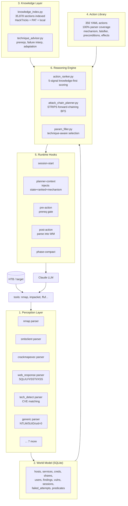

# TAR — Typed-Action Runtime

**An AI pentester that reasons like an expert, not like an autocomplete.**

TAR is a knowledge-grounded offensive-security agent that composes Claude (the LLM) with a deterministic runtime of parsers, a SQLite world model, an action library, and hooks that inject HackTricks/PayloadsAllTheThings/OCD-mindmap mechanism knowledge at every decision point. The design goal: root a HackTheBox Easy/Medium machine in ≤2 hours with the same discipline a human operator applies — hypothesis, mechanism, falsifier — rather than hallucinated command sequences or statistical walkthrough replay.

> **Before you read further: [AUDIT.md](AUDIT.md) is the brutal-honest gap analysis — what TAR cannot do yet, the destructive actions it will fire without a safety net, and the rabbit holes it falls into. Read it before the rest of this README if you are evaluating TAR for adoption or live use.**

## What's new in v2.1

- **Fourth knowledge source**: the Orange Cyberdefense 2025.03 AD Red Teaming Mindmap is indexed as a first-class methodology reference. See `docs/AD_METHODOLOGY.md` for the operator-facing walkthrough.
- **~46 new actions** covering SCCM (8), ADCS ESC9-15 + Certifried, Kerberos persistence (Skeleton Key, DCShadow, Custom SSP, DSRM, Saphire), noPac, PrivExchange, KeePass dump, Veeam CVEs, EternalBlue, Potato variants, UAC bypass, LSASS dump variants, trust-key extraction + ticket forging.
- **BloodHound Cypher library** (`knowledge/cypher/`) — 15 canonical queries indexable and callable from actions.
- **New planner goals** — `cross_forest_compromise`, `sccm_compromise`, `domain_persistence`, `hybrid_cloud_compromise`, `adcs_compromise`, `coerced_relay_chain`, `credential_extraction_onhost`.
- **30+ new technique advisor rules** — prerequisites + failure patterns for every added action.
- **43/43 integration tests passing**, parser coverage 356/356 (100%), hook latency ~3.5s.

---

## Why this exists

LLM agents for pentesting today fall into two failure modes:

1. **Bare LLM-in-loop** (PentestGPT, GPT-4-in-a-shell, AutoGPT-style): the model reads terminal output and emits the next command. No grounding. No memory. Burns context by re-discovering the same fact, hallucinates tools that don't exist, retries the same broken approach three times. Cost-bleeding and non-deterministic.

2. **Walkthrough-replay agents**: scrape HackTheBox writeups, learn `P(next_action | last_action, phase)`, then statistically pick the next step. Works on boxes that look like training data. Fails catastrophically on anything novel because there is no *understanding* — only pattern matching.

**TAR rejects both.** A real pentester doesn't keep a walkthrough in their head. They have *mechanism knowledge*: they know that ntlmrelayx intercepts NTLM auth on port 445 and relays to the target protocol, so the coercion method must callback specifically on port 445, which means PrinterBug works and DFSCoerce doesn't. That kind of reasoning requires HackTricks-grade knowledge, not statistical correlations.

TAR implements this by treating HackTricks and PayloadsAllTheThings as the primary knowledge source, indexed and injected at every decision boundary — with walkthroughs demoted to a tie-breaker signal.

---

## The Thesis

> Walkthroughs teach patterns. HackTricks teaches mechanisms. Patterns fail on novel targets; mechanisms generalise. Any autonomous pentest agent that wants to operate outside its training distribution must reason from mechanism, not from pattern.

Every architectural choice in TAR flows from that single thesis.

---

## Architecture at a glance



Claude never sees the raw knowledge base. It sees *curated injections* assembled per-turn from live world-model state, mechanism excerpts for the top-ranked techniques, failure interpretation for recent errors, and a proposed attack chain toward the current phase goal. That keeps the context window small, the cache prefix stable, and the reasoning grounded.

---

## What's in the box

| Layer | Components | Numbers |
|---|---|---|
| Parsers | nmap, smbclient, crackmapexec, gobuster, impacket, hashcat, **web_response**, **tech_detect**, **generic** + 4 | 13 parsers |
| World model | 10-table SQLite schema with predicate queries, failed-attempt ledger | 1 DB per engagement |
| Knowledge index | HackTricks + PAT + local, TF-IDF + inverted-token lookup | **35,878 sections** |
| Technique advisor | Prerequisites, failure interpretation, adaptation, mechanism briefs | **40+ techniques** curated |
| Action library | YAML actions across web/ad/sccm/services/privesc/binary/crypto/… | **356 actions, 100% parsers** |
| Ranker | 5-signal: knowledge (30pt), preconditions (25pt), service (20pt), info gain (15pt), transition (10pt) | walkthrough demoted 25→10 |
| Chain planner | STRIPS forward-chaining BFS over preconditions/effects | 9 goal types |
| Hooks | session-start, planner-context, pre-action, post-action, phase-compact | **8 hooks** |
| Tests | Integration across all layers | **35/35 passing** |
| Hook latency | Context injection on each user turn | **~3.2s** |

---

## Quick-start

```bash
# 1. Clone TAR and drop scripts/hooks into Claude Code's config
git clone https://github.com/0xthusharkiranreddy/tar.git
cd tar

# 2. Install: copies hooks to ~/.claude/hooks and scripts to ~/.claude/scripts
./install.sh

# 3. Point TAR at knowledge sources (edit SOURCES dict in knowledge_index.py)
#    Defaults: /home/kali/hacktricks, /home/kali/PayloadsAllTheThings, /home/kali/knowledge
python3 scripts/knowledge_index.py --rebuild     # first-time build, ~2.4s cold

# 4. Initialise an engagement and run
tar init --target 10.10.11.42 --name htb-forest
cd ~/engagements/htb-forest/
claude-code
```

See [`docs/USAGE.md`](docs/USAGE.md) for the full operator manual.

---

## How TAR uses HackTricks and PAT

This is the core of the system. Deep dive in [`docs/KNOWLEDGE_SOURCES.md`](docs/KNOWLEDGE_SOURCES.md).

Four injection points, each answering a different question:

| Injection point | Question | Example |
|---|---|---|
| **Technique context** — top-ranked action | *"How does this technique actually work?"* | kerberoast → 3-line HackTricks mechanism brief (SPN → TGS → hash → offline crack) |
| **Version-CVE matching** — service in WM | *"Is this version known-vulnerable?"* | Apache 2.4.49 → CVE-2021-41773 path traversal, 30pt score boost |
| **Failure interpretation** — after error | *"What does this failure actually mean?"* | kerberoast `"No entries found"` → "no SPN users in domain; try asreproast or rbcd" |
| **Alternatives** — after ≥2 failures | *"What else could I try?"* | SMB null-session blocked → PAT alternatives: guest auth, SNMP strings |

Knowledge isn't dumped to Claude. It is **scored, cached and trimmed per technique** so the planner-context hook assembles it in sub-3 seconds without re-scanning 35k sections.

---

## Comparison with existing approaches

Full analysis in [`docs/COMPARISON.md`](docs/COMPARISON.md).

| Axis | Bare LLM-in-loop | Walkthrough-replay | **TAR** |
|---|---|---|---|
| Grounding | hallucinates tools | only if box is in corpus | HackTricks/PAT + WM-verified |
| Adaptation to novel target | ✗ | ✗ | mechanism-based |
| Retry discipline | retries same cmd | weak | cross-engagement predicate ledger |
| Context efficiency | re-reads everything | mediocre | compacted WM + cached prefix |
| Multi-step planning | greedy | next-step lookup | STRIPS forward-chain |
| Deterministic replay | ✗ | partial | action YAMLs + WM snapshot |
| Failure interpretation | ✗ | ✗ | HackTricks-grounded |
| Cost | $$$$ | $$ | $ (cache-warm ~$0.40/box) |

---

## Repository layout

```
tar/
├── README.md                     ← you are here
├── docs/
│   ├── ARCHITECTURE.md           ← component-level deep dive
│   ├── INTELLIGENCE.md           ← reasoning-layer construction
│   ├── KNOWLEDGE_SOURCES.md      ← HackTricks/PAT integration details
│   ├── COMPARISON.md             ← vs PentestGPT/HackingBuddyGPT/AutoGPT
│   ├── ROADMAP.md                ← known gaps + upgrade path
│   └── USAGE.md                  ← operator manual
├── scripts/                      ← runtime engine
│   ├── knowledge_index.py        ← TF-IDF + inverted token lookup
│   ├── technique_advisor.py      ← prereq / failure / adaptation reasoning
│   ├── action_ranker.py          ← 5-signal knowledge-first scoring
│   ├── attack_chain_planner.py   ← STRIPS forward-chaining BFS
│   ├── param_filler.py           ← technique-aware parameter resolution
│   ├── world_model.py            ← SQLite schema + API
│   ├── parsers/                  ← 13 structured-output parsers
│   └── tests/test_v2_integration.py  ← 35-check integration suite
├── hooks/                        ← 8 hook scripts (session/pre/post/context/compact)
├── actions/                      ← 310 YAML actions across 12 categories
├── subagents/                    ← specialised subagents (recon, etc.)
└── walkthroughs/                 ← historical corpus (fallback signal only)
```

---

## Metrics (current state)

- **356 action YAMLs** across 13 categories (ad: 81, web: 68, services: 59, privesc: 57, creds: 13, crypto: 12, cms: 10, smb: 10, binary: 10, shell: 10, sccm: 8, pivoting: 7, recon: 4)
- **100% parser coverage** — every action has a parser so output lands in the WM
- **320+/356 actions** have meaningful effect predicates (enables multi-step planning)
- **35/35 integration tests** passing (knowledge, advisor, ranker, planner, parsers, hooks)
- **Hook latency** ~3.2s per user turn (knowledge index cache-warm 0.4s)
- **Index build** 2.4s cold, 0.4s from pickle cache
- **35,878 sections** indexed from HackTricks/PAT/local knowledge

---

## Honest gaps

Full list in [`docs/ROADMAP.md`](docs/ROADMAP.md). Highlights:

- **No live HTB run validation yet** — the planner produces credible multi-step plans on synthetic WM states but has not yet been run end-to-end against a retired Easy box with a published trace.
- **Action library is uneven** — web/ad/privesc are dense (183/310); recon has only 4 actions because most recon lives in the session-start subagent.
- **Parser ≠ deep parser** — the fallback is `generic_parser`, which catches NTLM/SUID/uid=0 but will miss service-specific structure. Hand-written parsers still needed for: sqlmap, responder, hashcat status, mimikatz output blocks.
- **Chain planner is depth-limited BFS** — fine up to depth 4; beyond that action-graph branching factor explodes. Planned: heuristic-guided A*, per-goal action subsetting.
- **Knowledge index is TF-IDF** — good enough for technique lookup, weak on conceptual queries. Planned: sentence-transformer embedding layer on top of TF-IDF shortlist.
- **No explicit exploit-writing loop** — TAR composes known techniques. It does not write new exploits. That is a deliberate scope boundary (and the next milestone).

---

## License

See `LICENSE`. Knowledge sources (HackTricks, PayloadsAllTheThings) retain their original licenses — TAR indexes them locally, does not redistribute content.

---

*TAR is an experiment in whether AI agents can learn to pentest the way humans do — by understanding mechanisms, not by memorising walkthroughs.*
