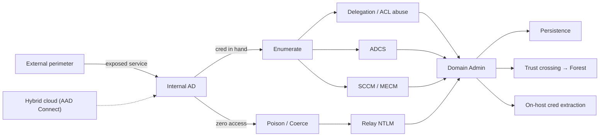
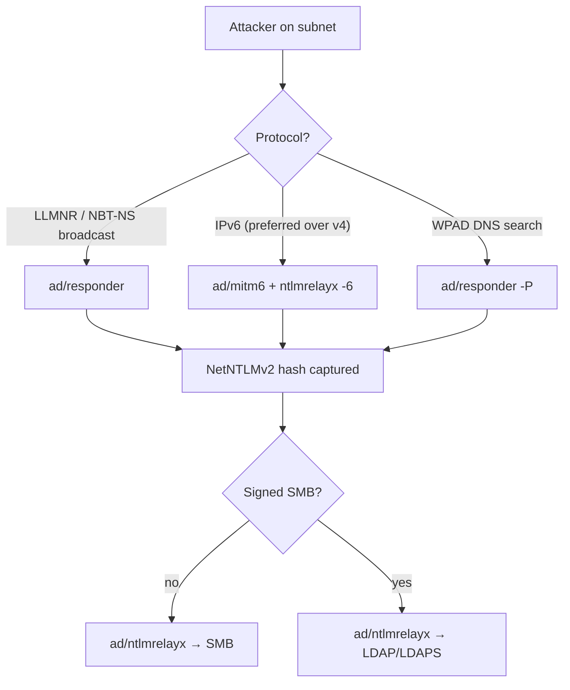
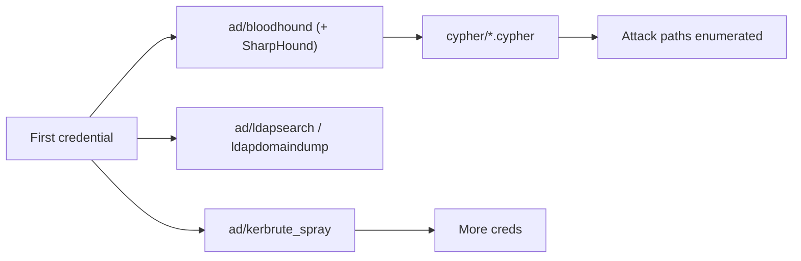
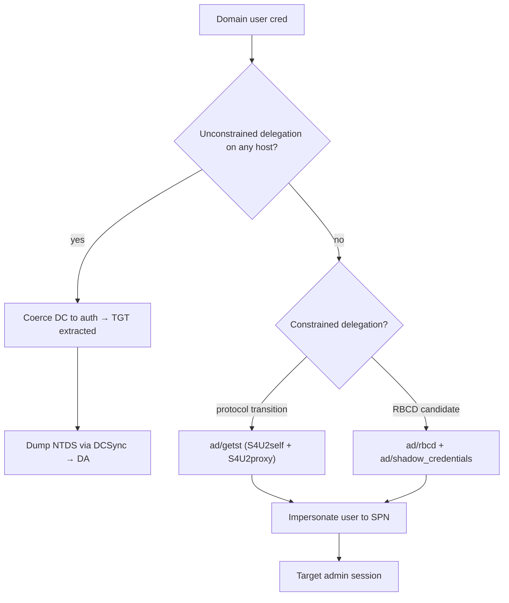
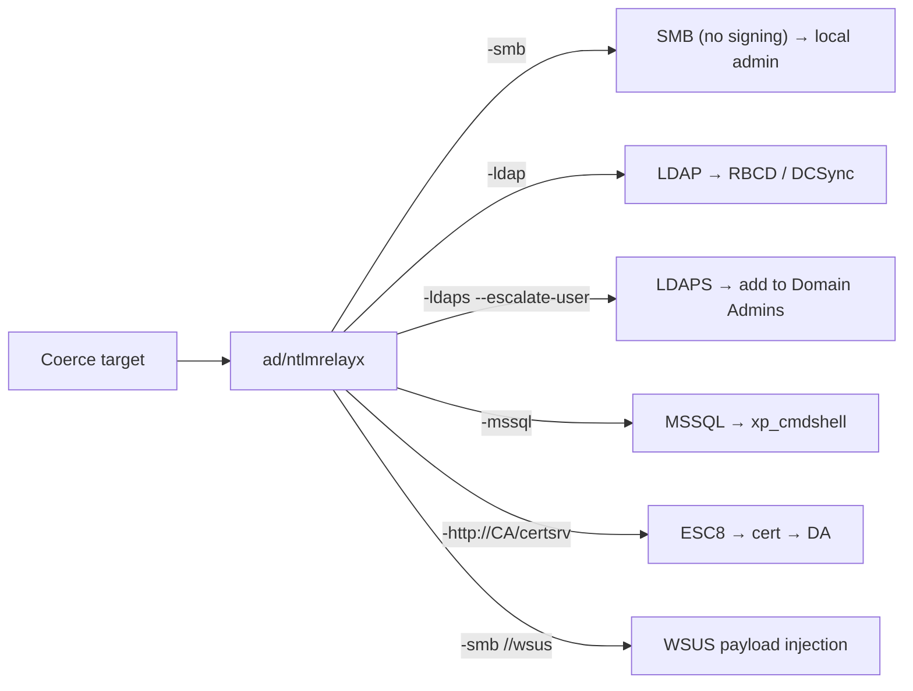
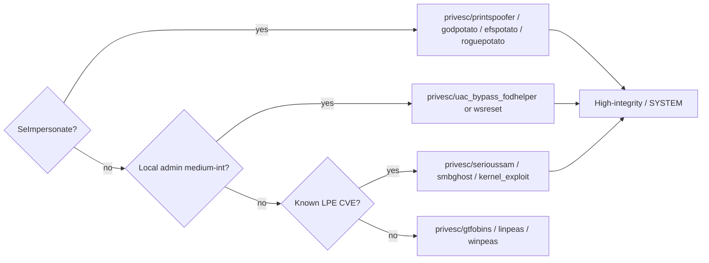
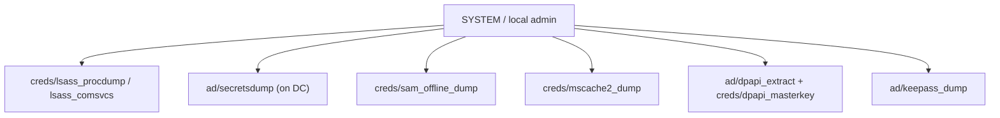
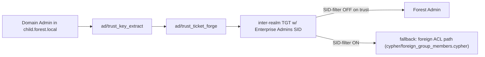
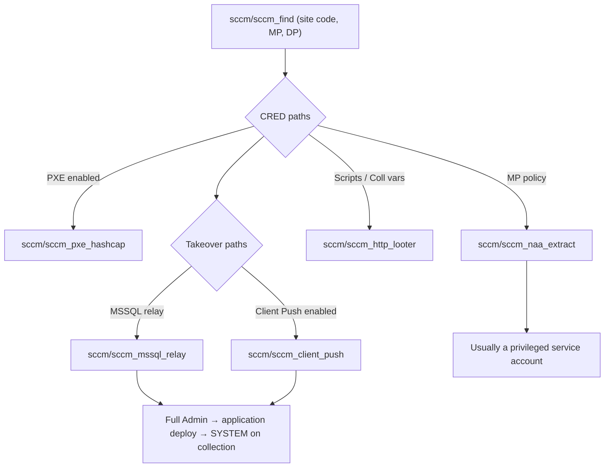

# AD Attack Methodology — the mechanism, not the mantra

This document is the operational spine of TAR's Active Directory reasoning layer. It is structured after the **Orange Cyberdefense 2025.03 AD Red Teaming Mindmap** (our canonical fourth knowledge source) and grounded in HackTricks and PayloadsAllTheThings.

For every branch we give: the **mechanism** (why it works), the **TAR action(s)** that implement it, and a **Mermaid flow** mapping the decision points.

> **Reading rule.** Every technique in this document has an action file at `actions/<category>/<name>.yml`. The YAML is the machine-readable contract: preconditions, command template, falsifier pattern, expected effects. The prose here explains *why*; the YAML is what actually runs.

---

## 1. The attack surface



## 2. Zero-access recon

No credentials, L2/L3 reachable. Map what's there before poisoning.

| Question | TAR action | Mechanism |
|---|---|---|
| Which hosts exist? | `recon/nmap_full` | TCP SYN + version detection |
| Is SMB null-session allowed? | `ad/ldap_anon`, `smb/smb_null_session` | Pre-auth LDAP BIND + SMB IPC$ |
| Any roastable users without creds? | `services/kerberos_enum`, `ad/asreproast` (blind) | UDP/88 principal probing |
| Any writable shares? | `smb/smb_enum` | Anonymous or guest SMB tree connect |

Mindmap branches: **Recon / Anon enum (Branch 1–2)**.

## 3. Unauth poisoning

Still no cred, but attacker is L2-adjacent. Make the victim come to you.



Fail-stops to look for:
- `ntlmrelayx` prints "signing is required" → relay to LDAP/LDAPS
- Only captured `DC$` → relay it, don't crack it (machine-account RC4 is NT-hash length random)
- `mitm6` silent → RA guard / DHCPv6 guard on switches

Actions: `ad/responder`, `ad/mitm6`, `ad/ntlm_theft_file_drop`, `ad/ntlmrelayx`.

## 4. Coercion with no creds

Unauth PetitPotam (`nil` session variant) works against older Windows Server builds. Also ntlm-theft file drops (`.url`, `.scf`, `.lnk`) into frequented shares.

Branch: **Coercion / Printer Bug + PetitPotam + DFSCoerce + WebDAV (Branch 4)**.

## 5. Credential capture

After cred or after cracking a captured hash.

| Target | Action | Hashcat mode |
|---|---|---|
| AS-REP | `ad/asreproast` | 18200 |
| Kerberoast | `ad/kerberoast` | 13100 |
| TimeRoast | `ad/timeroast` | 31300 |
| PXE boot var | `sccm/sccm_pxe_hashcap` | custom |
| MSCache2 | `creds/mscache2_dump` | 2100 |

Blind variants when you don't have creds but you have WriteProperty on a user: `ad/blind_kerberoast`, `ad/targetedkerberoast`.

## 6. Credential spray & enum



Cypher library: `cypher/kerberoastable.cypher`, `cypher/rbcd_candidates.cypher`, `cypher/shadow_cred_candidates.cypher`, `cypher/readlaps.cypher`, `cypher/readgmsa.cypher`, `cypher/gpo_controllers.cypher`, `cypher/ou_genericall.cypher`, `cypher/dcsync_rights.cypher`, `cypher/trust_map.cypher`, `cypher/high_value_paths.cypher`, `cypher/foreign_group_members.cypher`, `cypher/esc1_vulnerable_templates.cypher`, `cypher/unconstrained_delegation.cypher`, `cypher/constrained_delegation.cypher`, `cypher/asreproastable.cypher`.

## 7. Kerberos delegation



Kerberos-relay escalations: `ad/krbrelayup` (SYSTEM on a domain-joined host), `ad/samaccountname_spoof` (noPac → instant DA).

## 8. ADCS — full tree

Fifteen escalation paths, each a distinct misconfiguration class.

| ESC | Core misconfig | TAR action |
|---|---|---|
| ESC1 | ENROLLEE_SUPPLIES_SUBJECT + CLIENT_AUTH | `ad/adcs_esc1` |
| ESC4 | WriteDacl over template | `ad/adcs_esc4` |
| ESC8 | Web-enrollment NTLM relay | `ad/adcs_esc8` + `ad/ntlmrelayx` |
| ESC9 | No security-extension + UPN spoof | `ad/adcs_esc9` |
| ESC10 | Weak KDC StrongCertificateBindingEnforcement | `ad/adcs_esc10` |
| ESC13 | msDS-OIDToGroupLink | `ad/adcs_esc13` |
| ESC14 | WriteProperty on altSecurityIdentities | `ad/adcs_esc14` |
| ESC15 / EKUwu | v1 template + application-policies CSR | `ad/adcs_esc15` |
| Certifried | dNSHostName spoof on computer | `ad/certifried` |
| Pass-the-cert | PFX → Schannel LDAP bind | `ad/passthecert` |

Detection-friendly discovery: `certipy find -vulnerable` then run the specific action. Every path ends in PKINIT → TGT → DA.

## 9. NTLM relay tree



Coercion inventory: `ad/petitpotam_relay`, `services/spoolsample`, `services/coerced_auth_methods` (DFSCoerce/PrinterBug/PetitPotam/ShadowCoerce), `services/shadowcoerce`.

## 10. Lateral movement

| Protocol | Action |
|---|---|
| SMB (named pipe) | `ad/passthehash`/`impacket psexec` |
| WMI | `ad/wmi_enum` |
| DCOM | `dcomexec` (via impacket) |
| Scheduled task | `atexec` |
| WinRM | `services/winrm_exec` |
| RDP with cert | `ad/passthecert` |

## 11. Local privesc to SYSTEM



AppLocker/WDAC bypass: `privesc/applocker_bypass_msbuild`.
Cross-session coercion for Citrix/RDS boxes: `privesc/remotepotato0`.

## 12. Credential extraction once on the box



LSA Protection / Credential Guard → use on-disk alternatives (SAM, DPAPI, MSCache2) rather than banging on lsass.

## 13. Persistence

Silent, resilient; survives password rotation.

| Technique | Action | Requires |
|---|---|---|
| Golden ticket | `ad/golden_ticket` | krbtgt hash |
| Silver ticket | `ad/silver_ticket` | service NT hash |
| Diamond ticket | `ad/diamond_ticket` | krbtgt AES key |
| Saphire ticket | `ad/saphire_ticket` | krbtgt + target SID set |
| Skeleton Key | `ad/skeleton_key` | SYSTEM on DC |
| DCShadow | `ad/dc_shadow` | DA or replication-owner |
| Custom SSP | `ad/custom_ssp` | SYSTEM on DC |
| DSRM password | `ad/dsrm_password` | SYSTEM on DC |

Mindmap branch: **Persistence (Branch 14)**.

## 14. Trust crossing → Forest admin



Actions: `ad/trust_key_extract`, `ad/trust_ticket_forge`, `ad/sid_history`, `ad/trusts_enum`.

## 15. SCCM ecosystem



Paths from mindmap: CRED-1..6 → NAA extraction, Scripts, CollectionVariables. Takeover-1/2 → Client Push / MSSQL. Elevate-1/2/3 → script/app/collection deployment.

## 16. Hybrid AD — Azure AD Connect

`ad/msol_password` extracts the `MSOL_*` service account password from the Azure AD Connect server's LocalDB. This account holds **Directory Synchronization Accounts** rights in on-prem AD → DCSync. It also holds Global Admin on the Azure tenant in older AADConnect deployments → full hybrid compromise.

## 17. Hash-cracking cheatsheet

| Type | Hashcat mode | Command snippet |
|---|---|---|
| NTLM | 1000 | `hashcat -m 1000 hash rockyou.txt` |
| NetNTLMv2 | 5600 | `hashcat -m 5600 hash rockyou.txt` |
| TGS (Kerberoast) | 13100 | `hashcat -m 13100 hash rockyou.txt` |
| AS-REP | 18200 | `hashcat -m 18200 hash rockyou.txt` |
| MSCache2 | 2100 | `hashcat -m 2100 hash rockyou.txt` |
| Machine (TimeRoast) | 31300 | `hashcat -m 31300 hash rockyou.txt` |
| DPAPI masterkey | 15300 | `hashcat -m 15300 hash rockyou.txt` |

## 18. Quick wins

Before climbing the ladder, throw these at the fence:

- `ad/zerologon` — CVE-2020-1472 (any unpatched DC pre-Aug 2020)
- `ad/printnightmare` — CVE-2021-34527
- `ad/samaccountname_spoof` / `ad/nopac` — CVE-2021-42278/79
- `ad/goldenpac_ms14068` — legacy Server 2003/2008 DCs
- `ad/gpp_password` — MS14-025 SYSVOL cpassword
- `services/eternalblue` — MS17-010
- `services/veeam_cve2024_40711`, `services/veeam_cve2023_27532`
- `ad/privexchange` — old Exchange WriteDacl path
- `ad/dnsadmins` — DNSAdmins → dnscmd /ServerLevelPluginDll

---

## Reading the YAML

```yaml
name: certifried                                   # action id
category: ad                                       # category (== directory)
preconditions:                                     # must all hold in WorldModel
- domain_joined
- has_cred
- machine_account_quota_positive
command_template: certipy account create ...       # what the operator runs
parser: generic_parser                             # how output becomes findings
expected_effects:                                  # what predicates it asserts
- computer_cert_obtained
- dc_certificate_obtained
- domain_admin
falsifier:                                         # what says "this didn't work"
  pattern: STATUS_DUPLICATE_NAME|MachineAccountQuota|ACCESS_DENIED
  timeout: 60
mechanism: |                                       # mechanism-grounded reasoning
  CVE-2022-26923. Create a computer with controllable dNSHostName ...
references:
  ocd_mindmap: 'Branch 7: Certifried (CVE-2022-26923)'
  hacktricks: ad-certificates/domain-escalation.md
```

TAR's planner consumes `preconditions` + `expected_effects` to build multi-step chains; the hook consumes `mechanism` to *reason*, not to pattern-match; the ranker consumes the full set of signals + WorldModel to decide what to try next.

This is why the thesis works: **every command we run is preceded by a hypothesis, a mechanism, and a falsifier.** If the falsifier fires, the WorldModel updates and the next action is chosen *from a different branch* — not a retry of the same class with slightly different flags. That's the difference between replay and reasoning.
